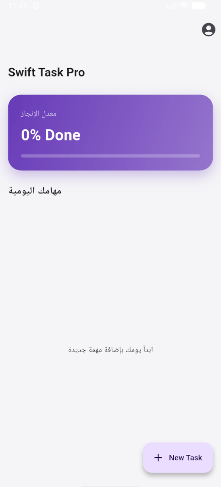

# 🚀 Swift Task Pro - Premium Flutter Management

Swift Task Pro is a high-performance, modern task management application built with **Flutter**. It features a sophisticated **Material 3 UI**, professional gradients, and a robust offline database architecture.

## ✨ Tech Preview
<p align="center">
  
  
  
  
</p>

## 🛠️ Key Features
* **Modern UI/UX**: Professional Slivers, glassmorphism effects, and dynamic gradients.
* **Persistence**: Full offline support using **SQLite** (sqflite).
* **State Management**: Optimized data flow using the **Provider** pattern.
* **Smart Analytics**: Real-time progress tracking and task statistics.
* **Productivity Tools**: Priority-based sorting, categories, and full CRUD operations.

## 🚀 Tech Stack
* **Framework**: Flutter (Stable)
* **Language**: Dart
* **Database**: SQLite
* **State Management**: Provider
* **UI Components**: Material 3, Google Fonts

## 💻 How to Run
```bash
git clone [https://github.com/m3haned00/swift_task_pro.git](https://github.com/m3haned00/swift_task_pro.git)
cd swift_task_pro
flutter pub get
flutter run
